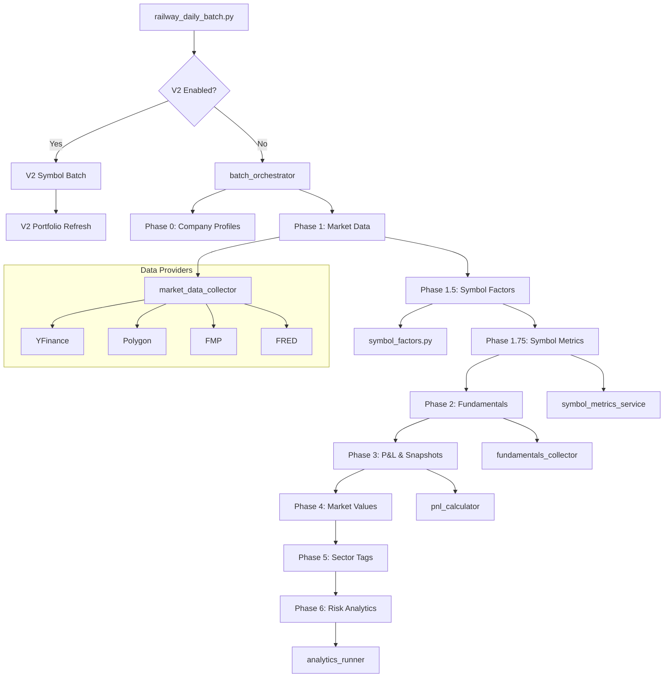
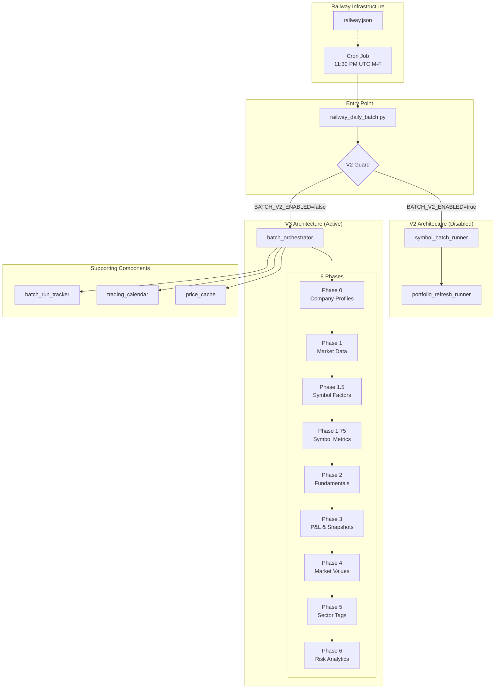

# Batch Processing Architecture

**Last Updated**: 2026-01-13
**Author**: Claude Code
**Target Audience**: Developers maintaining the SigmaSight batch processing system

---

## Executive Summary

SigmaSight's batch processing system is a **9-phase production-ready architecture** that runs after market close to calculate portfolio analytics, risk metrics, and P&L. The system is deployed on **Railway** with automatic cron scheduling.

**Key characteristics:**
- **Entry Point**: `scripts/automation/railway_daily_batch.py` (Railway cron job)
- **Orchestrator**: `app/batch/batch_orchestrator.py` (2,341 lines, main engine)
- **Schedule**: Weekdays at 11:30 PM UTC (6:30 PM ET, after market close)
- **Architecture**: 9 phases with automatic backfill, phase isolation, and failure recovery
- **Alternative**: V2 parallel architecture exists but is disabled by default

```
┌──────────────────────────────────────────────────────────────────────┐
│                    BATCH PROCESSING FLOW                              │
├──────────────────────────────────────────────────────────────────────┤
│                                                                       │
│  Railway Cron (11:30 PM UTC)                                         │
│         │                                                             │
│         ▼                                                             │
│  railway_daily_batch.py                                               │
│         │                                                             │
│         ├──► V2 Guard Check (BATCH_V2_ENABLED?)                      │
│         │         │                                                   │
│         │    [if true] ──► V2 Symbol Batch + Portfolio Refresh       │
│         │                                                             │
│         ▼ [if false]                                                 │
│  batch_orchestrator.run_daily_batch_with_backfill()                  │
│         │                                                             │
│         ├──► Phase 0: Company Profile Sync                           │
│         ├──► Phase 1: Market Data Collection                         │
│         ├──► Phase 1.5: Symbol Factor Calculation                    │
│         ├──► Phase 1.75: Symbol Metrics Calculation                  │
│         ├──► Phase 2: Fundamental Data Collection                    │
│         ├──► Phase 3: P&L Calculation & Snapshots                    │
│         ├──► Phase 4: Position Market Value Updates                  │
│         ├──► Phase 5: Sector Tag Restoration                         │
│         └──► Phase 6: Risk Analytics                                 │
│                                                                       │
└──────────────────────────────────────────────────────────────────────┘
```

---

## Table of Contents

1. [Railway Infrastructure](#1-railway-infrastructure)
2. [Entry Point: railway_daily_batch.py](#2-entry-point-railway_daily_batchpy)
3. [Batch Orchestrator (V3)](#3-batch-orchestrator-v3)
4. [Phase-by-Phase Walkthrough](#4-phase-by-phase-walkthrough)
5. [Supporting Components](#5-supporting-components)
6. [V2 Alternative Architecture](#6-v2-alternative-architecture)
7. [Manual Entry Points](#7-manual-entry-points)
8. [Technical Debt & Dead-End Scripts](#8-technical-debt--dead-end-scripts)
9. [Recommendations](#9-recommendations)
10. [Quick Reference](#10-quick-reference)

---

## 1. Railway Infrastructure

### 1.1 Cron Configuration

Railway uses `railway.json` to configure the batch cron job:

```json
{
  "$schema": "https://railway.com/railway.schema.json",
  "deploy": {
    "cronSchedule": "30 23 * * 1-5",
    "restartPolicyType": "ON_FAILURE",
    "restartPolicyMaxRetries": 3,
    "startCommand": "uv run python scripts/automation/railway_daily_batch.py"
  }
}
```

| Setting | Value | Description |
|---------|-------|-------------|
| `cronSchedule` | `30 23 * * 1-5` | 11:30 PM UTC, Monday-Friday (6:30 PM ET) |
| `restartPolicyType` | `ON_FAILURE` | Auto-restart on failures |
| `restartPolicyMaxRetries` | `3` | Maximum 3 restart attempts |
| `startCommand` | `uv run python scripts/automation/railway_daily_batch.py` | Entry point script |

### 1.2 Environment Variables (Railway)

```bash
# Core Database (gondola) - portfolios, positions, market data
DATABASE_URL=postgresql+asyncpg://...@gondola.proxy.rlwy.net:.../railway

# AI Database (metro) - RAG, memories, feedback
AI_DATABASE_URL=postgresql+asyncpg://...@metro.proxy.rlwy.net:.../railway

# Market Data APIs
POLYGON_API_KEY=...
FMP_API_KEY=...
FRED_API_KEY=...

# Optional: Enable V2 batch architecture
BATCH_V2_ENABLED=false  # Default: false (V3 is primary)

# Railway detection (auto-set by Railway)
RAILWAY_ENVIRONMENT=production
```

### 1.3 Railway-Specific Handling

The entry script automatically converts Railway's `DATABASE_URL` format:

```python
# railway_daily_batch.py (lines 39-44)
if 'DATABASE_URL' in os.environ:
    db_url = os.environ['DATABASE_URL']
    if db_url.startswith('postgresql://'):
        os.environ['DATABASE_URL'] = db_url.replace(
            'postgresql://', 'postgresql+asyncpg://', 1
        )
```

This ensures compatibility with SQLAlchemy's asyncpg driver.

---

## 2. Entry Point: railway_daily_batch.py

**File**: `backend/scripts/automation/railway_daily_batch.py` (254 lines)

### 2.1 Responsibilities

1. **DATABASE_URL Conversion**: Convert Railway's PostgreSQL URL to asyncpg format
2. **V2 Guard Check**: Route to V2 architecture if `BATCH_V2_ENABLED=true`
3. **Factor Definition Seeding**: Ensure factor definitions exist before processing
4. **Batch Execution**: Call the batch orchestrator
5. **Exit Code Management**: Return proper exit codes for Railway health monitoring

### 2.2 Flow Diagram

```
┌─────────────────────────────────────────────────────────────┐
│              railway_daily_batch.py                          │
├─────────────────────────────────────────────────────────────┤
│                                                              │
│  1. Fix DATABASE_URL format (postgresql → asyncpg)          │
│         │                                                    │
│         ▼                                                    │
│  2. Check V2 Guard (settings.BATCH_V2_ENABLED)              │
│         │                                                    │
│    ┌────┴────┐                                              │
│    │         │                                              │
│   true     false                                            │
│    │         │                                              │
│    ▼         ▼                                              │
│  run_v2_batch()    3. ensure_factor_definitions()           │
│    │               │                                         │
│    ▼               ▼                                         │
│  Exit(0/1)    4. batch_orchestrator.run_daily_batch_with_   │
│                   backfill()                                 │
│                   │                                          │
│                   ▼                                          │
│              5. Print completion summary                     │
│                   │                                          │
│                   ▼                                          │
│              6. Exit(0) on success, Exit(1) on failure      │
│                                                              │
└─────────────────────────────────────────────────────────────┘
```

### 2.3 V2 Guard Logic

```python
async def check_v2_guard():
    """Redirect to V2 batch when BATCH_V2_ENABLED=true"""
    if settings.BATCH_V2_ENABLED:
        success = await run_v2_batch()
        sys.exit(0 if success else 1)
    return False  # Continue with V1/V3
```

---

## 3. Batch Orchestrator (V3)

**File**: `backend/app/batch/batch_orchestrator.py` (2,341 lines)

### 3.1 Architecture Overview

The BatchOrchestrator class implements a **9-phase production-ready system** with:

- **Automatic backfill detection** - Detects missed days and processes them
- **Phase isolation** - Failures in one phase don't cascade to others
- **Performance tracking** - Real-time progress updates via `batch_run_tracker`
- **Dual-session support** - Separate Core and AI database connections
- **Price caching** - In-memory cache for 366 days of price history

### 3.2 Main Entry Point

```python
async def run_daily_batch_with_backfill(
    self,
    start_date: Optional[date] = None,
    end_date: Optional[date] = None,
    portfolio_ids: Optional[List[str]] = None,
    portfolio_id: Optional[str] = None,  # Single portfolio mode
    source: Optional[str] = None,        # Entry point tracking
    force_rerun: bool = False,           # Force reprocess dates
) -> Dict[str, Any]:
```

**Key features:**
- **Cron mode** (`portfolio_id=None`): Process entire symbol universe
- **Single-portfolio mode** (`portfolio_id=X`): ~40x faster, only processes that portfolio's symbols
- **Automatic date detection**: Uses NY timezone, adjusts for market hours

### 3.3 Phase Execution Matrix

```
┌────────┬─────────────────────────────────┬───────────┬─────────────────┬────────────────────────────┐
│ PHASE  │ NAME                            │ RUNS      │ FREQUENCY       │ KEY OUTPUT                 │
├────────┼─────────────────────────────────┼───────────┼─────────────────┼────────────────────────────┤
│ 0      │ Company Profile Sync            │ 1x/batch  │ Final date only │ company_profiles           │
│ 1      │ Market Data Collection          │ 1x/date   │ All dates       │ market_data_cache          │
│ 1.5    │ Symbol Factor Calculation       │ 1x/batch  │ Final date only │ symbol_factor_exposures    │
│ 1.75   │ Symbol Metrics Calculation      │ 1x/batch  │ Final date only │ symbol_daily_metrics       │
│ 2      │ Fundamental Data Collection     │ 1x/date   │ All dates       │ company_profiles           │
│ 3      │ P&L Calculation & Snapshots     │ 1x/date   │ All dates       │ portfolio_snapshots        │
│ 4      │ Position Market Value Updates   │ 1x/date   │ All dates       │ positions (updated)        │
│ 5      │ Sector Tag Restoration          │ 1x/date   │ Final date      │ position_tags              │
│ 6      │ Risk Analytics                  │ 1x/date   │ All dates       │ factor_exposures, betas    │
└────────┴─────────────────────────────────┴───────────┴─────────────────┴────────────────────────────┘
```

### 3.4 Key Design Insight: O(symbols) Optimization

Phase 1.5 pre-computes factor betas at the **SYMBOL level** (not position level):

> Factor betas are intrinsic to the symbol (AAPL's momentum beta is the same in every portfolio). Pre-compute once per symbol, then aggregate via position weights at portfolio level.

This achieves **O(symbols)** complexity instead of **O(users × symbols × dates)**.

---

## 4. Phase-by-Phase Walkthrough

### Phase 0: Company Profile Sync

**Purpose**: Fetch fresh company profile data (beta values, sector, industry) before calculations

**Runs**: Once per batch, on final date only

**Implementation**: `app/services/company_profile_service.py`

**Key fields synced (53 total)**:
- Beta value (critical for risk calculations)
- Sector and industry classification
- Market cap, revenue estimates, earnings estimates
- Company description and metadata

---

### Phase 1: Market Data Collection

**File**: `backend/app/batch/market_data_collector.py` (983 lines)

**Purpose**: Fetch 1-year historical market data for all symbols

**Provider chain**: YFinance → YahooQuery → Polygon → FMP

**Smart fetch modes**:
| Mode | Days | Trigger |
|------|------|---------|
| Incremental | 1 | Normal daily run |
| Gap-fill | 2-30 | Missing recent data |
| Backfill | 365 | New symbol or major gap |

**Key method**: `collect_daily_market_data()`

```python
async def collect_daily_market_data(
    calculation_date: date,
    lookback_days: int = 365,
    db: AsyncSession,
    portfolio_ids: Optional[List[str]] = None,
    skip_company_profiles: bool = False,
    scoped_only: bool = False,
) -> Dict[str, Any]
```

---

### Phase 1.5: Symbol Factor Calculation

**File**: `backend/app/calculations/symbol_factors.py`

**Purpose**: Pre-compute factor betas for all symbols (universe-level)

**Calculation types**:
1. **Ridge regression** - Regularized factor exposures
2. **Spread analysis** - Growth vs Value, Momentum, Quality, Size, Low Vol

**Key method**: `calculate_universe_factors()`

**Output table**: `symbol_factor_exposures`

---

### Phase 1.75: Symbol Metrics Calculation

**File**: `backend/app/services/symbol_metrics_service.py`

**Purpose**: Pre-calculate returns and valuation metrics for all symbols

**Metrics calculated**:
- Daily/weekly/monthly/YTD returns
- Valuation ratios
- Denormalized factor exposures (for quick lookup)

**Output table**: `symbol_daily_metrics`

---

### Phase 2: Fundamental Data Collection

**File**: `backend/app/batch/fundamentals_collector.py` (360 lines)

**Purpose**: Fetch earnings-driven fundamental data

**Smart fetching**: Only fetches if 3+ days after earnings date (reduces API calls by 80-90%)

**Data fetched**:
- Income statements
- Balance sheets
- Cash flow statements

**Key method**: `collect_fundamentals_data()`

---

### Phase 3: P&L Calculation & Snapshots

**File**: `backend/app/batch/pnl_calculator.py` (571 lines)

**Purpose**: Calculate portfolio P&L and create historical snapshots

**Calculation method**: Simple mark-to-market P&L (unrealized gains/losses)

**Equity rollforward formula**:
```
new_equity = previous_equity + daily_pnl
```

**Two-phase snapshot creation**:
1. Lock snapshot slot (prevent race conditions)
2. Populate snapshot data

**Key method**: `calculate_all_portfolios_pnl()`

---

### Phase 4: Position Market Value Updates

**Purpose**: Update position market values for current prices

**Added**: October 29, 2025

**Why needed**: Analytics accuracy depends on current market values

---

### Phase 5: Sector Tag Restoration

**Purpose**: Auto-tag positions with sector from company profiles

**Runs**: Final date only

**Data source**: Company profiles fetched in Phase 0

---

### Phase 6: Risk Analytics

**File**: `backend/app/batch/analytics_runner.py` (1,069 lines)

**Purpose**: Calculate all risk metrics using cached data

**Calculations performed**:
| Metric | Window | Description |
|--------|--------|-------------|
| Market beta | 90-day | Regression vs SPY |
| Provider beta | 1-year | From data providers |
| Interest rate beta | 90-day | Regression vs TLT |
| Factor analysis | 1-year | Ridge + spread using Phase 1.5 data |
| Sector analysis | Current | Exposure by sector |
| Volatility analytics | HAR model | Volatility forecasting |
| Correlations | 90-day | Position and factor correlations |
| Stress testing | Various | Market risk scenarios |

**Key method**: `run_all_portfolios_analytics()`

---

## 5. Supporting Components

### 5.1 Batch Run Tracker

**File**: `backend/app/batch/batch_run_tracker.py` (1,278 lines)

**Purpose**: Real-time progress tracking and activity logging

**Key classes**:
- `BatchRunTracker` - Singleton for batch state management
- `CurrentBatchRun` - Current batch run information
- `BatchActivityLogHandler` - Captures INFO logs from calculation engines

**Integration**: Attached to logging system for Railway-level debugging

### 5.2 Trading Calendar

**File**: `backend/app/utils/trading_calendar.py`

**Purpose**: Trading day detection and adjustment

**Key methods**:
- `is_trading_day(date)` - Check if date is a trading day
- `get_previous_trading_day(date)` - Get last trading day
- `get_trading_days_between(start, end)` - Get list of trading days

### 5.3 Price Cache

**File**: `backend/app/cache/price_cache.py`

**Purpose**: In-memory cache for 366 days of price history

**Benefits**: Eliminates redundant database queries during batch processing

### 5.4 Batch History Service

**File**: `backend/app/services/batch_history_service.py`

**Purpose**: Record batch start/completion in `batch_run_history` table

**Functions**:
- `record_batch_start(batch_run_id, triggered_by, total_jobs)`
- `record_batch_complete(batch_run_id, status, completed_jobs, failed_jobs, ...)`

---

## 6. V2 Alternative Architecture

**Directory**: `backend/app/batch/v2/`

**Status**: Alternative system, disabled by default (`BATCH_V2_ENABLED=false`)

### 6.1 V2 Architecture Components

```
┌─────────────────────────────────────────────────────────────┐
│                    V2 ARCHITECTURE                           │
├─────────────────────────────────────────────────────────────┤
│                                                              │
│  Two-Cron System:                                           │
│                                                              │
│  9:00 PM ET: symbol_batch_runner.py                         │
│      └── Process ALL symbols nightly                        │
│          └── Write to symbol cache                          │
│                                                              │
│  9:30 PM ET: portfolio_refresh_runner.py                    │
│      └── Refresh portfolios using cached data               │
│          └── Create snapshots + analytics                   │
│                                                              │
│  On-Demand: symbol_onboarding.py                            │
│      └── Instant symbol processing (<5 seconds)             │
│                                                              │
└─────────────────────────────────────────────────────────────┘
```

### 6.2 V2 Files

| File | Purpose | Lines |
|------|---------|-------|
| `symbol_batch_runner.py` | Process all symbols nightly | ~300 |
| `portfolio_refresh_runner.py` | Refresh portfolios using cached data | ~250 |
| `symbol_onboarding.py` | Instant on-demand symbol processing | ~200 |

### 6.3 V2 vs V3 Trade-offs

| Aspect | V3 (Current) | V2 (Alternative) |
|--------|--------------|------------------|
| Cron jobs | 1 | 2 |
| Symbol processing | Per-batch | Nightly pre-compute |
| Onboarding speed | 15-30 min | <5 seconds |
| Complexity | Lower | Higher |
| Status | Production | Available but disabled |

---

## 7. Manual Entry Points

### 7.1 CLI Batch Runner

**File**: `backend/scripts/batch_processing/run_batch.py`

**Purpose**: CLI wrapper with better console output for operators

**Usage**:
```bash
uv run python scripts/batch_processing/run_batch.py \
    [--portfolio UUID] \
    [--start-date YYYY-MM-DD] \
    [--end-date YYYY-MM-DD] \
    [--summary-json]
```

### 7.2 Quick Test Script

**File**: `backend/scripts/run_batch_now.py`

**Purpose**: Minimal wrapper for quick batch execution

### 7.3 Admin API Endpoints

**File**: `backend/app/api/v1/endpoints/admin_batch.py`

| Endpoint | Method | Purpose |
|----------|--------|---------|
| `/api/v1/admin/batch/run` | POST | Trigger batch processing |
| `/api/v1/admin/batch/run/current` | GET | Get current batch status |
| `/api/v1/admin/batch/trigger/market-data` | POST | Manual market data trigger |
| `/api/v1/admin/batch/trigger/correlations` | POST | Manual correlation trigger |
| `/api/v1/admin/batch/data-quality` | GET | Data quality metrics |
| `/api/v1/admin/batch/data-quality/refresh` | POST | Refresh market data quality |

---

## 8. Technical Debt & Dead-End Scripts

### 8.1 Archived Scripts (DO NOT USE)

**Location**: `backend/scripts/_archive/`

These scripts are archived and should not be used:

| Category | Path | Status |
|----------|------|--------|
| Analysis investigations | `_archive/analysis_investigations/` | One-time debug scripts |
| Old monitoring | `_archive/root_scripts/run_batch_with_monitoring.py` | Replaced by batch_run_tracker |
| Data ops one-time | `_archive/data_ops_one_time/` | One-time data fixes |
| Completed migrations | `_archive/completed_migrations/` | Historical migration scripts |
| Manual tests | `_archive/manual_tests/` | Ad-hoc test scripts |
| Test API providers | `_archive/test_api_providers/` | Provider testing (one-time) |

### 8.2 V2 Batch Files

**Location**: `backend/app/batch/v2/`

**Status**: Exists but disabled by default

**Recommendation**: Keep for now, but consider removal if V2 is never adopted. Currently adds maintenance burden without providing value.

### 8.3 Duplicate/Redundant Scripts

| Script | Location | Status | Recommendation |
|--------|----------|--------|----------------|
| `run_symbol_batch.py` | `scripts/batch_processing/` | V2 entry point | Remove if V2 deprecated |
| `run_portfolio_refresh.py` | `scripts/batch_processing/` | V2 entry point | Remove if V2 deprecated |
| `run_batch_now.py` | `scripts/` | Quick test | Keep but document |
| `DANGEROUS_*` scripts | `scripts/DANGEROUS_DESTRUCTIVE_SCRIPTS/` | Destructive operations | Keep with warnings |

### 8.4 Potential Dead Code in Main Orchestrator

The batch orchestrator has legacy list output handling (lines 92-141 in `run_batch.py`) that may never be triggered since the orchestrator now returns dict format.

---

## 9. Recommendations

### 9.1 High Priority

| Item | Description | Effort | Impact |
|------|-------------|--------|--------|
| **Remove V2 if unused** | If V2 is never enabled in production, remove `app/batch/v2/` and related scripts | Medium | Reduces maintenance |
| **Archive more scripts** | Move `scripts/analysis/` debugging scripts to `_archive/` | Low | Cleaner structure |
| **Document DANGEROUS scripts** | Add README to `DANGEROUS_DESTRUCTIVE_SCRIPTS/` explaining each script's purpose | Low | Prevents accidents |

### 9.2 Medium Priority

| Item | Description | Effort | Impact |
|------|-------------|--------|--------|
| **Clean up legacy output handling** | Remove legacy list output handling in `run_batch.py` | Low | Cleaner code |
| **Consolidate verification scripts** | Many `scripts/verification/` scripts could be combined | Medium | Easier maintenance |
| **Add batch monitoring dashboard** | Create admin UI for batch status (beyond API) | High | Better observability |

### 9.3 Low Priority (Future)

| Item | Description | Effort | Impact |
|------|-------------|--------|--------|
| **Persistent price cache** | Cache prices to disk to survive restarts | Medium | Faster restarts |
| **Phase 1.5 caching extension** | Cache symbol factors longer if fundamentals stable | Medium | Faster batch runs |
| **Parallel phase execution** | Run independent phases in parallel (e.g., 1.5 and 1.75) | High | Faster batch runs |

---

## 10. Quick Reference

### 10.1 Key Files

```
scripts/automation/
└── railway_daily_batch.py     # Railway cron entry point (254 lines)

app/batch/
├── batch_orchestrator.py      # Main orchestrator (2,341 lines) ⭐
├── batch_run_tracker.py       # Progress tracking (1,278 lines)
├── market_data_collector.py   # Phase 1 (983 lines)
├── fundamentals_collector.py  # Phase 2 (360 lines)
├── pnl_calculator.py          # Phase 3 (571 lines)
├── analytics_runner.py        # Phase 6 (1,069 lines)
├── scheduler_config.py        # APScheduler config (463 lines)
└── v2/                        # Alternative architecture (disabled)
    ├── symbol_batch_runner.py
    ├── portfolio_refresh_runner.py
    └── symbol_onboarding.py

scripts/batch_processing/
├── run_batch.py               # CLI batch runner
├── run_symbol_batch.py        # V2 entry point
└── run_portfolio_refresh.py   # V2 entry point

railway.json                   # Railway cron configuration
```

### 10.2 Running Batch Manually

```bash
# Local development - full batch
cd backend
uv run python scripts/batch_processing/run_batch.py

# Local development - specific portfolio
uv run python scripts/batch_processing/run_batch.py --portfolio <UUID>

# Local development - date range
uv run python scripts/batch_processing/run_batch.py \
    --start-date 2026-01-01 \
    --end-date 2026-01-10

# Railway - manual trigger via API
curl -X POST https://your-railway-url/api/v1/admin/batch/run \
    -H "Authorization: Bearer <token>"
```

### 10.3 Monitoring Batch Status

```bash
# Check current batch status
curl https://your-railway-url/api/v1/admin/batch/run/current \
    -H "Authorization: Bearer <token>"

# View Railway logs
railway logs --service SigmaSight-BE

# Check batch_run_history table
SELECT * FROM batch_run_history
ORDER BY started_at DESC
LIMIT 10;
```

### 10.4 Dependency Graph



---

## Appendix: Mermaid Flowchart

For systems that support Mermaid rendering:



---

*Document generated by Claude Code on 2026-01-13*
